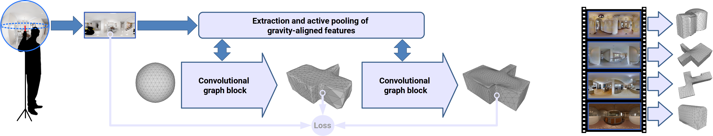
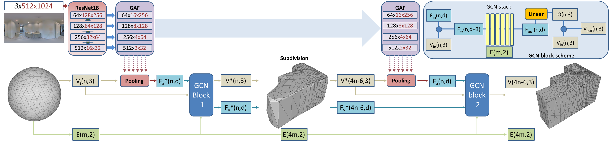

# Deep3DLayout
 Pytorch demo code of the Siggraph Asia 2021 paper: Deep3DLayout: 3D Reconstruction of an Indoor Layoutfrom a Spherical Panoramic Image.
 
 

Recovering the 3D shape of the bounding permanent surfaces of a room from a single image is a key component of indoor reconstruction pipelines. In order to deal with visual ambiguities and vast amounts of occlusion and clutter, current approaches operate in very restrictive settings, mostly imposing stringent planarity and orientation priors, relying on corner or edge visibility, and/or extruding 2D solutions to 3D.
In this article, we significantly expand the reconstruction space by introducing a novel deep learning technique capable to produce, at interactive rates, a tessellated bounding 3D surface from a single 360 image.
Differently from prior solutions, we fully address the problem in 3D, without resorting to 2D footprint or 1D corner extraction.
The indoor layout is represented by a 3D graph-encoded object, exploiting graph convolutional networks to directly infer the room structure as a 3D mesh. The network produces a correct geometry by progressively deforming a tessellated sphere mapped to the spherical panorama, leveraging perceptual features extracted from the input image. Important 3D properties of indoor environments are exploited in our design. In particular, gravity-aligned features are actively incorporated in the graph in a projection layer that exploits the recent concept of multi head self-attention, and specialized losses guide towards plausible solutions even in presence of massive clutter and occlusions.
 
This repo is a **python** implementation where you can test **layout mesh inference** on an indoor equirectangular image.

**Method Pipeline overview**:


## Updates
* 2021-12-10 Code release


## Installation Requirements
- Python >=3.6
- pytorch>=1.0.1
- torchvision
- numpy
- PIL
- matplotlib.pyplot
- PyTorch3D
- open3d (for mesh visualization)

The implementation of Deep3DLayout is based on [PyTorch3D](https://github.com/facebookresearch/pytorch3d).
You will first need to install that in order to be able to run Deep3DLayout.

## Pretrained weights.
Copy to your local ./ckpt directory:
- [m3d_layout.pth](https://vicserver.crs4.it/tmp/deep3dlayout/m3d_layout.pth). Trained using the [MatterportLayout](https://github.com/ericsujw/Matterport3DLayoutAnnotation) original splitting.
- [pano3d_layout.pth](https://vicserver.crs4.it/tmp/deep3dlayout/pano3d_layout.pth). Finetuned using the [Pano3DLayout] dataset(https://github.com/EvaAlmansa/Pano3DLayout).
- other models to appear

## Inference on equirectagular images	
Here an example of inferring using the pre-trained model on Matterport3D:
```
python inference.py --pth ckpt/m3d_layout.pth --img input/UwV83HsGsw3_71ada030981d4468b76dcebc1b6fb940.png

```    
    - `--pth` path to the trained model.
    - `--img` path to the input equirectangular image.
	- `--visualize` enable/disable output mesh visualization
	- `--save_obj` save or not the output mesh as obj.
	- `--output_dir` path to save obj results. 

## Acknowledgement
- We acknowledge the contribution of the European Union’s H2020 research and innovation programme under grant agreements 813170 (EVOCATION). 
The provided demo is released to complement the publication under the conditions of the mentioned projects, while the full source code remains the property of CRS4, 
except for the portions of code indicated in the headers of this release and derived from work released under [BSD-3-Clause License](LICENSE).
- Part of this release leverages implementations proposed by [Mesh R-CNN](https://github.com/facebookresearch/meshrcnn). We thank the authors for their great work and repo.
	
## Citation
Please cite our paper for any purpose of usage.
```
@Article{Pintore:2021:D3R,
    author = {Giovanni Pintore and Eva Almansa and Marco Agus and Enrico Gobbetti},
    title = {{Deep3DLayout}: {3D} Reconstruction of an Indoor Layout from a Spherical Panoramic Image},
    journal = {ACM Transactions on Graphics},
    volume = {40},
    number = {6},
    pages = {250:1--250:12},
    month = {December},
    year = {2021},
    doi = {10.1145/3478513.3480480},
    note = {Proc. SIGGRAPH Asia 2021. To appear},
    url = {http://vic.crs4.it/vic/cgi-bin/bib-page.cgi?id='Pintore:2021:D3R'},
}
```